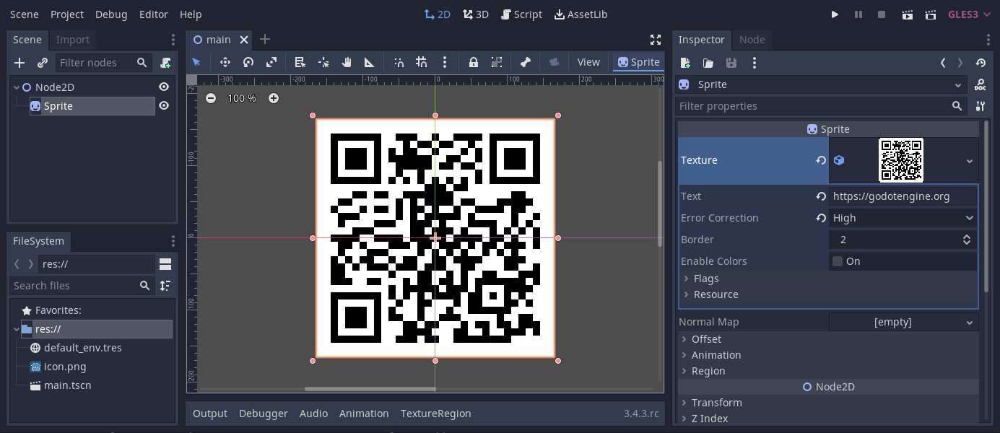

QRCodeTexture Godot Module
=========================



Summary
------------

This module is a simple, lightweight and flexible way to generate QR codes in Godot. It provides a new type of texture that constitutes a QR code based on its properties.


This module uses the fantastic [Nayuki QR code generator library](https://www.nayuki.io/page/qr-code-generator-library) under the hood.

Usage
--------

With this module you will be able to select ```QRCodeTexture``` from any texture drop-drop menu (e.g. sprite nodes, material albedo texture, etc.). All ```QRCodeTexture``` properties are exposed to the editor so it's easy to use without scripting.

That said, here's an example of a script attached to a Sprite that makes itself a ```QRCodeTexture``` in GDScript:
```gdscript
extends Sprite

func _ready():
	var new_qr_code_texture = QRCodeTexture.new()
	new_qr_code_texture.text = "https://godotengine.org"
	self.texture = new_qr_code_texture
```

Properties
--------

```QRCodeTexture``` has several properties to control the way the QR code is generated.

* ```text``` is a string of the information the QR code contains.
  * Default: ```""```
* ```error_correction``` is an integer that controls the amount of error correction. Higher levels increase how much of the QR code can be obscured for a scan to work, but it also increases the size of the code.
  * Default: ```QRCodeTexture.ERROR_CORRECTION_MEDIUM```
  * Possible values:
    * ```QRCodeTexture.ERROR_CORRECTION_LOW``` - Approx 7% error correction capability
    * ```QRCodeTexture.ERROR_CORRECTION_MEDIUM``` - Approx 15% error correction capability
    * ```QRCodeTexture.ERROR_CORRECTION_QUARTILE``` - Approx 25% error correction capability
    * ```QRCodeTexture.ERROR_CORRECTION_HIGH``` - Approx 30% error correction capability
* ```border``` is an integer that controls the border size of background color around the QR code.
  * Default: ```2```
* ```enable_colors``` is a bool that determines the use of colors and the format of the texture.
  * Default: ```false```
  * If set to ```false``` the texture data format will be ```Image.FORMAT_L8```
  * If set to ```true``` the texture data format will be ```Image.FORMAT_RGB8```
  * A more efficient way to apply colors is to set this property to false and render the colors in a shader.
* ```background_color```
  * Default: ```Color(1.0, 1.0, 1.0)```
  * Only used if ```enable_colors``` is ```true```
* ```foreground_color```
  * Default: ```Color(0.0, 0.0, 0.0)```
  * Only used if ```enable_colors``` is ```true```

Tips for scanner compatibility
--------

There are many different programs for scanning QR codes, and not all can deal with the same amount of variance in QR codes. Don't assume that because you can scan a code that everyone can. Keep the following in mind:
* A dark foreground with light background works best. Some QR scanners can deal with a dark background and light foreground, but not all.
* Try and maintain a high level of contrast between the foreground and background.
* Keep a thick border of background color around the QR code. 
* Use a high amount of error correction, especially if your code will be partially obscured, distorted or decorated.

Installation
--------

1. Download the source code for Godot
2. Place this code in the Godot modules directory under the name ```qrcodetexture``` (e.g. ```godot_src/modules/qrcodetexture/```)
3. Compile the engine ([Instructions here](https://docs.godotengine.org/en/stable/development/compiling/index.html))


License
-------

MIT License

Copyright © 2022 Benjamin Armstrong

Permission is hereby granted, free of charge, to any person obtaining a copy
of this software and associated documentation files (the "Software"), to deal
in the Software without restriction, including without limitation the rights
to use, copy, modify, merge, publish, distribute, sublicense, and/or sell
copies of the Software, and to permit persons to whom the Software is
furnished to do so, subject to the following conditions:

* The above copyright notice and this permission notice shall be included in all
copies or substantial portions of the Software.

* THE SOFTWARE IS PROVIDED "AS IS", WITHOUT WARRANTY OF ANY KIND, EXPRESS OR
IMPLIED, INCLUDING BUT NOT LIMITED TO THE WARRANTIES OF MERCHANTABILITY,
FITNESS FOR A PARTICULAR PURPOSE AND NONINFRINGEMENT. IN NO EVENT SHALL THE
AUTHORS OR COPYRIGHT HOLDERS BE LIABLE FOR ANY CLAIM, DAMAGES OR OTHER
LIABILITY, WHETHER IN AN ACTION OF CONTRACT, TORT OR OTHERWISE, ARISING FROM,
OUT OF OR IN CONNECTION WITH THE SOFTWARE OR THE USE OR OTHER DEALINGS IN THE
SOFTWARE.

QR Code Generator Library License
-------

Copyright © 2021 Project Nayuki. (MIT License)  
[https://www.nayuki.io/page/qr-code-generator-library](https://www.nayuki.io/page/qr-code-generator-library)

Permission is hereby granted, free of charge, to any person obtaining a copy of
this software and associated documentation files (the "Software"), to deal in
the Software without restriction, including without limitation the rights to
use, copy, modify, merge, publish, distribute, sublicense, and/or sell copies of
the Software, and to permit persons to whom the Software is furnished to do so,
subject to the following conditions:

* The above copyright notice and this permission notice shall be included in
  all copies or substantial portions of the Software.

* The Software is provided "as is", without warranty of any kind, express or
  implied, including but not limited to the warranties of merchantability,
  fitness for a particular purpose and noninfringement. In no event shall the
  authors or copyright holders be liable for any claim, damages or other
  liability, whether in an action of contract, tort or otherwise, arising from,
  out of or in connection with the Software or the use or other dealings in the
  Software.
